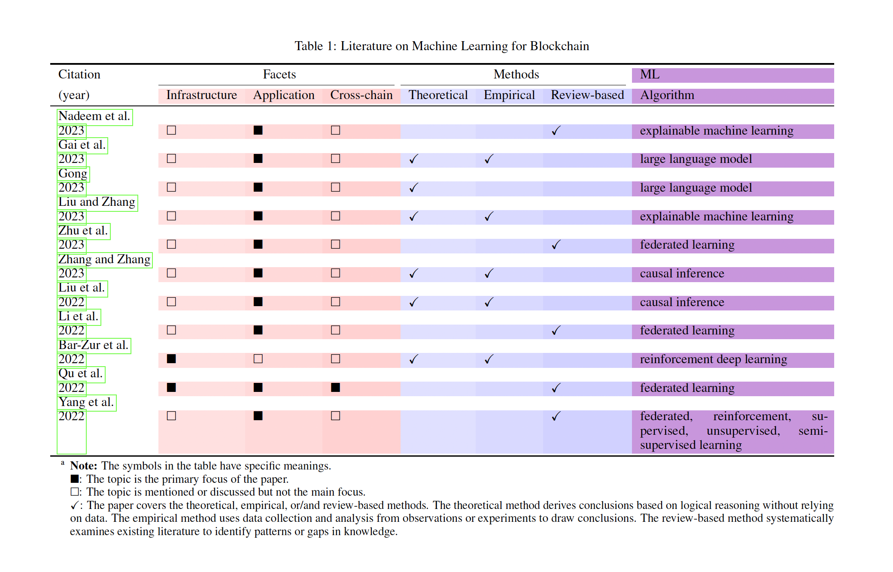
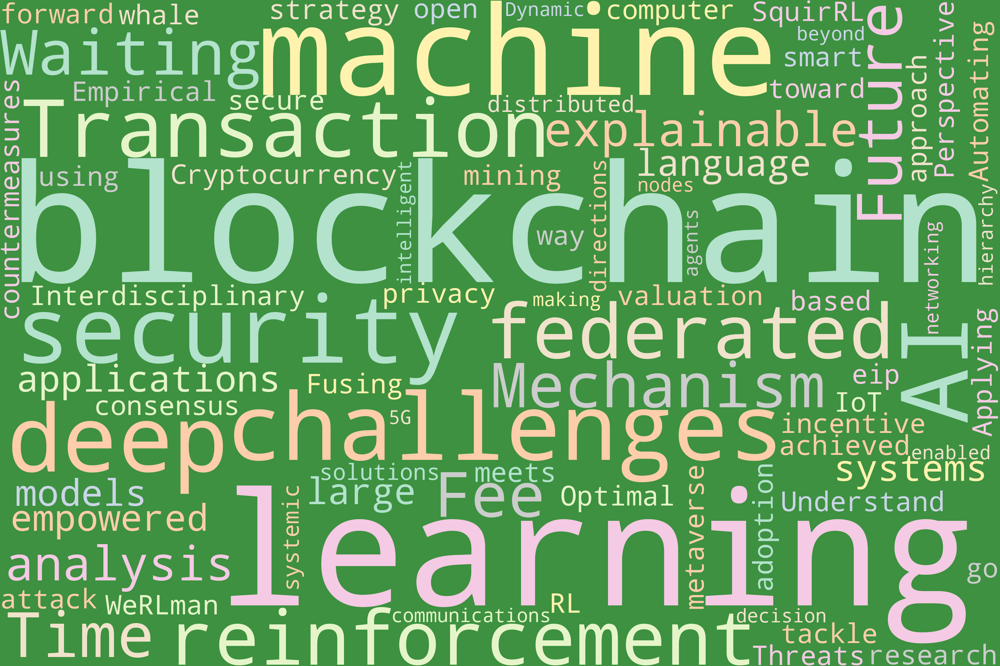
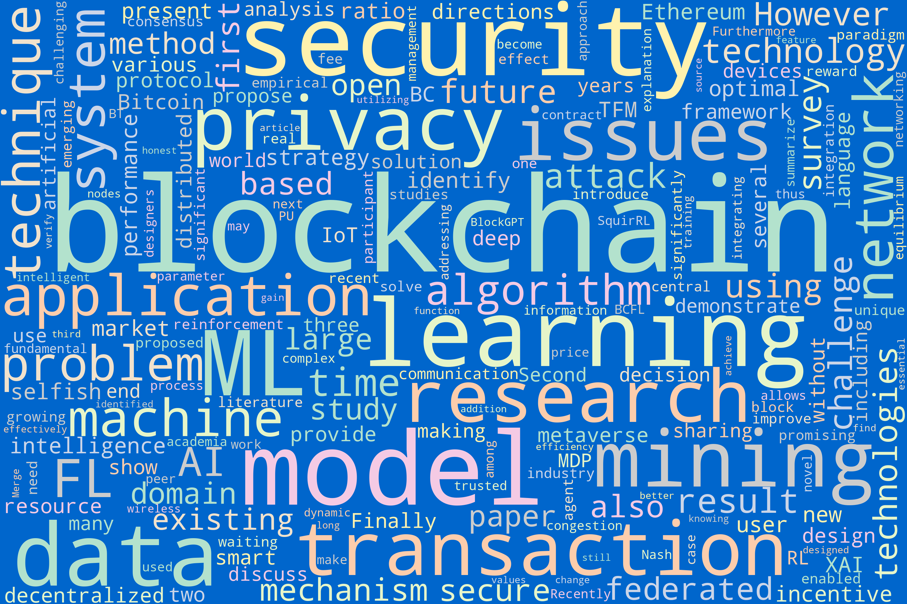
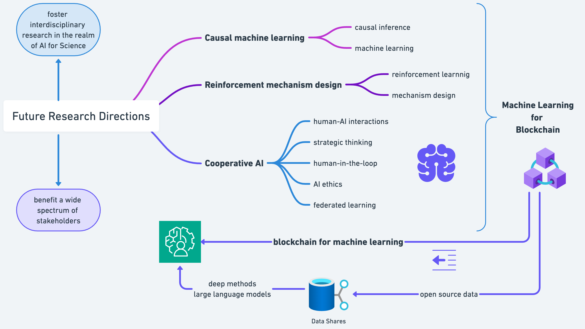

# ml4blockchain
## Supplementary Material for "Machine Learning for Blockchain: Literature Review and Open Research Questions."

### At a Glance

<table>
    <tr>
        <td>
            
        </td>
    </tr>
    <tr>
        <td>
            <strong>Notes:</strong> 
            As illustrated in the figure above, this paper offers an in-depth review of cutting-edge literature concerning the integration of blockchain with machine learning (ML). We emphasize the critical role of ML in enhancing the current infrastructure, applications, and cross-chain solutions of blockchain. A focal point of our discussion is blockchain's inherent security and decentralized nature, coupled with its growing need for sophisticated intelligence. Moreover, we venture into future research directions, intersecting blockchain and ML in domains such as causal machine learning, reinforcement mechanism design, and cooperative AI. Our objective is to foster interdisciplinary research in the realm of AI for Science with the potential to benefit a wide spectrum of stakeholders, from individual users to larger organizations.
        </td>
    </tr>
</table>

### Literature Reveiw

    Table 1 and Table 2 showcase a curated selection of literature that intersects machine learning and blockchain.

<table align="center">
    <tr>
        <td>
            
        </td>
    </tr>
    <tr>
        <td>
            
        </td>
    </tr>
</table>

<table align="center">
    <tr>
        <td>
            
        </td>
        <td>
            
        </td>
    </tr>
    <tr>
        <td align="center">
            <b>Figure 1: The word cloud of literature titles</b>
        </td>
        <td align="center">
            <b>Figure 2: The word cloud of literature abstracts</b>
        </td>
    </tr>
</table>

    Figure 1 and 2 further represent the word cloud of the title and abstract of the literature in Table 1 and Table 2.

### Future Research Directions

Additionally, we chart prospective research trajectories, weaving together blockchain and machine learning in niche domains like causal machine learning, reinforcement mechanism design, and cooperative AI. These intersections aim to cultivate interdisciplinary pursuits in AI for Science, catering to a broad spectrum of stakeholders.

