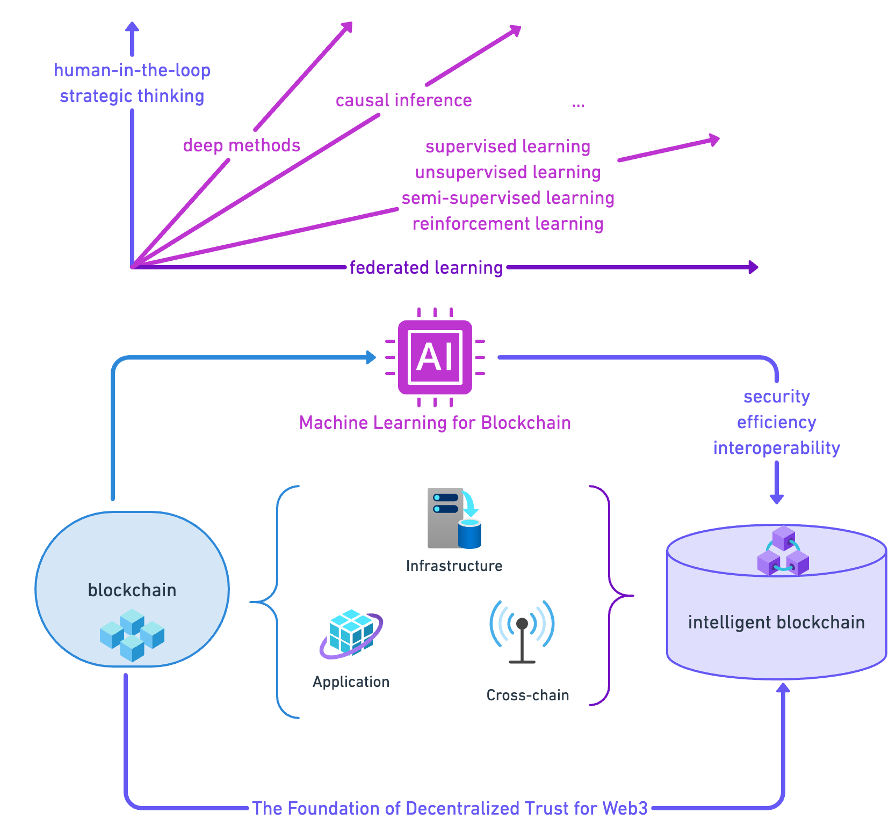

# ml4blockchain
## Supplementary Material for "Machine Learning for Blockchain: Literature Review and Open Research Questions."

<table>
    <tr>
        <td>
            
        </td>
        <td>
            <strong>Notes:</strong> 
            As illustrated in the figure on the left, this paper offers an in-depth review of cutting-edge literature concerning the integration of blockchain with machine learning (ML). We emphasize the critical role of ML in enhancing the current infrastructure, applications, and cross-chain solutions of blockchain. A focal point of our discussion is blockchain's inherent security and decentralized nature, coupled with its growing need for sophisticated intelligence. Moreover, we venture into future research directions, intersecting blockchain and ML in domains such as causal machine learning, reinforcement mechanism design, and cooperative AI. Our objective is to foster interdisciplinary research in the realm of AI for Science with the potential to benefit a wide spectrum of stakeholders, from individual users to larger organizations.
        </td>
    </tr>
</table>

